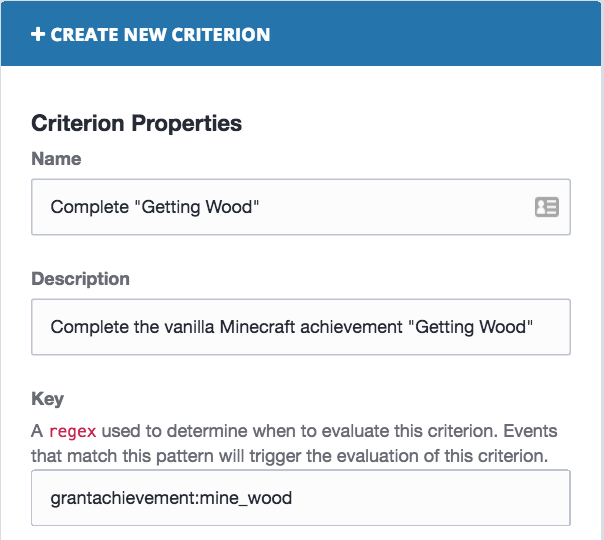

# Extending Minecraft Achievements

Vanilla Minecraft has its own achievement tree, where one achievement is only unlocked when a different one is earned. BadgeUp allows you to easily extend this achievement tree with your own achievements.

When a *vanilla Minecraft* achievement is granted to a player, the BadgeUp plugin sends an event with this key: `grantachievement:<achievement id>`. Because of this, you can simply make the completion of a specific *vanilla Minecraft* a *criterion* for your BadgeUp achievement:

For reference, the table below contains the IDs of all vanilla Minecraft achievements

| Name                 | Description                                                         | ID                   |
| -------------------- | ------------------------------------------------------------------- | -------------------- |
| Delicious Fish       | Catch and cook fish!                                                | cook_fish            |
| DIAMONDS!            | Acquire diamonds with your iron tools                               | diamonds             |
| Beaconator           | Create a full beacon                                                | full_beacon          |
| On A Rail            | Travel by minecart at least 1 km from where you started             | on_a_rail            |
| Time to Mine!        | Use planks and sticks to make a pickaxe                             | build_pickaxe        |
| Diamonds to you!     | Throw diamonds at another player                                    | diamonds_to_you      |
| Acquire Hardware     | Smelt an iron ingot                                                 | acquire_iron         |
| The Beginning?       | Spawn the Wither                                                    | spawn_wither         |
| The End?             | Locate the End                                                      | the_end              |
| Taking Inventory     | Press 'E' to open your inventory                                    | open_inventory       |
| Hot Topic            | Construct a furnace out of eight cobblestone blocks                 | build_furnace        |
| The End.             | Defeat the Ender Dragon                                             | the_end2             |
| Benchmarking         | Craft a workbench with four blocks of planks                        | build_work_bench     |
| Into Fire            | Relieve a Blaze of its rod                                          | blaze_rod            |
| Repopulation         | Breed two cows with wheat                                           | breed_cow            |
| Librarian            | Build some bookshelves to improve your enchantment table            | bookcase             |
| Cow Tipper           | Harvest some leather                                                | kill_cow             |
| We Need to Go Deeper | Build a portal to the Nether                                        | portal               |
| Return to Sender     | Destroy a Ghast with a fireball                                     | ghast                |
| When Pigs Fly        | Fly a pig off a cliff                                               | fly_pig              |
| The Lie              | Wheat, sugar, milk and eggs!                                        | bake_cake            |
| Getting Wood         | Attack a tree until a block of wood pops out                        | mine_wood            |
| Overkill             | Deal nine hearts of damage in a single hit                          | overkill             |
| Local Brewery        | Brew a potion                                                       | potion               |
| Monster Hunter       | Attack and destroy a monster                                        | kill_enemy           |
| The Beginning.       | Kill the Wither                                                     | kill_wither          |
| Time to Strike!      | Use planks and sticks to make a sword                               | build_sword          |
| Enchanter            | Use a book, obsidian and diamonds to construct an enchantment table | enchantments         |
| Time to Farm!        | Use planks and sticks to make a hoe                                 | build_hoe            |
| Getting an Upgrade   | Construct a better pickaxe                                          | build_better_pickaxe |
| Overpowered          | Eat a Notch apple                                                   | overpowered          |
| Bake Bread           | Turn wheat into bread                                               | make_bread           |
| Sniper Duel          | Kill a skeleton with an arrow from more than 50 meters              | snipe_skeleton       |
| Adventuring Time     | Discover all biomes                                                 | explore_all_biomes   |